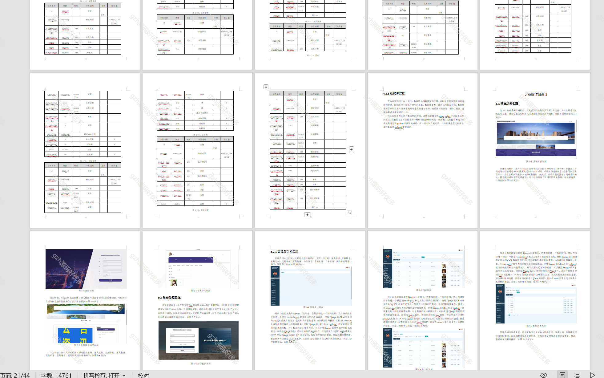

# python013
python013基于Django的家居全屋定制系统
 
## 查看主页获取源码

### 一、关键词

家居商城、家具商城，家具定制、

 

### 二、作品包含

源码+数据库+万字文档+PPT+全套环境和工具资源+部署教程

 

### 三、项目技术

前端技术：Html、Css、Js、Vue2.0、Element-ui
后端技术：Python3.7、Django2.0

  

 

### 四、运行环境（以下版本亲测，其他版本未知，请自测）

开发工具：PyCharm + VSCODE

数据库：MySQL5.7（最低要5.7版本）

数据库管理工具：Navicat10+

Python：Python3.7

前端Nodejs：14

浏览器：谷歌浏览器

 

### 五、项目介绍

项目编号：python013

西西家居全屋定制系统是一种创新性的家居装饰解决方案，它以个性化设计、高效服务、优质材料和智能化生产为核心特点，致力于为用户提供高品质、个性化的居住环境。随着人们对生活品质和个性化需求的不断提高，西西家居全屋定制系统有望成为家居行业的新趋势。

系统主要包括首页、用户、设计师、家具分类、家具信息、家具定制、定制分配、家具数据、公告信息、系统管理、订单管理、我的信息等功能，从而实现智能化的西西家居全屋定制管理方式，提高西西家居全屋定制管理的效率。 

 

### 六、运行截图

